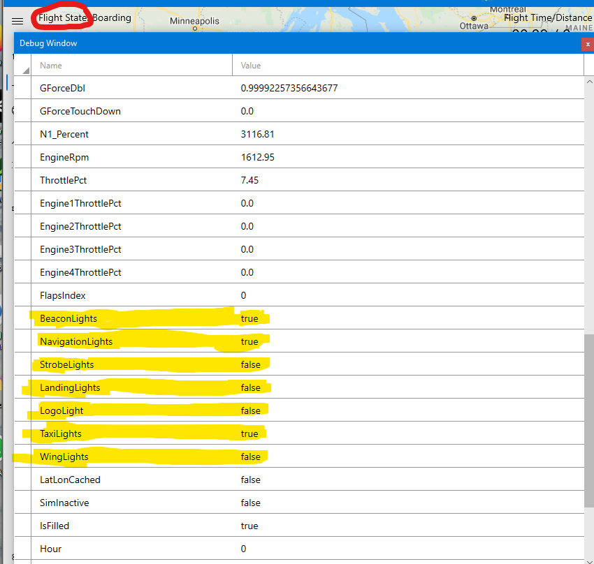

Since developers often use custom offsets or datarefs, and not the defaults, having configmaps allows you to map an aircraft feature (landing lights, etc) to a "feature", which tells ACARS where to read the data for those features. They're stored in the `configmaps` directory.

:::note
Config maps are now only for FSX/P3D or X-Plane. A lot of developers use the default offsets or datarefs, so it may not be required to change anything
:::

If you create a configmap for an aircraft, please let me know, I can include it in ACARS to be distributed out. That would be much appreciated!

## Anatomy of a ConfigMap

A config map is an XML file which looks like this:

```xml title="configmaps/FlightFactorA320.xml (truncated)"
<?xml version="1.0" encoding="utf-8" ?>
<Rules>
  <Rule Simulator="X-Plane" TitleContains="FlightFactor A320">
    <!-- ... -->
    <LandingLights>
      <Key Type="Int" Key="a320/Overhead/LightLandL" Value="1|2"/>
      <Key Type="Int" Key="a320/Overhead/LightLandR" Value="1|2"/>
    </LandingLights>
    <!-- ... -->
  </Rule>
</Rules>
```

A rule defines:

1. Who the rule is for
    - The simulator it's for (either `X-Plane` or `FSX/Prepar3d`)
    - The aircraft title contains. This is how it's filtered. It must be broad but also specific to make sure it "catches" the right plane type.
        - Each word is looked for and it's AND'd. In the example above, "FlightFactor" and "A320" must be present
        - For FSX/P3d, the value looked at is the aircraft title field, offset `0x3D00`
        - For X-Plane, the value looked at is `sim/aircraft/view/acf_descrip`
1. The feature (see below)
    - The maps - a group of datarefs or offsets which constitute that feature being "on" or "enabled"

In the above example, for the FlightFactor A320, the landing lights are controlled by two datarefs, both of which the values need to be 1 or 2 for the landing lights to be considered "on".

## Features

The base rules and rule types are available. This list may be expanded in the future.

- BeaconLights
- LandingLights
- NavigationLights
- StrobeLights
- TaxiLight
- WingLight

### Mapping data to a feature

Each `Key` consists a `Type`, `Key` and a `Value`. These are all "AND" together, so every value in the feature must evaluate to true.

```xml title=Example Rule
<Key Type="Int" Key="a320/Overhead/LightLandL" Value="1|2"/>
```

1. `Type`, which can be:
    - `Bool` - a `Value` is not required, the sim returns a `1` or `0` for this value
    - `Byte`
    - `Number`/`Double`/`Float`
    - `Int`
    - `Short`
    - `Mask`
2. `Key` - This is where ACARS will look to get the value. 
    - `FSX/Prepar3d` - This is an FSUIPC offset. LVars aren't supported, though you can use LINDA and FSUIPC to map an LVAR to a custom offset, and read it here. This information is up to the aircraft developer to provide.
    - `X-Plane` - This is a dataref value
3. `Value` 
    - This is what value to look for, in the case of a non-boolean type. You can use the OR operator (`|`) to separate multiple values


:::note
A note for X-Plane: the `sim/cockpit/electrical` datarefs are usually not great to use - X-Plane emulates the electrical system, so the values may toggle between 0 and 1, for example, when the strobe light is blinking, the electrical will toggle between 0 and 1. These would show up as the strobe being on. You generally want to check any switches (see Debugging below)
:::

#### Examples

In this example, both of the datarefs, in this last, the left and right landing lights, must have a value of `1` or `2` in order for the landing lights to be considered "on"

```xml
<LandingLights>
    <Key Type="Int" Key="a320/Overhead/LightLandL" Value="1|2"/>
    <Key Type="Int" Key="a320/Overhead/LightLandR" Value="1|2"/>
</LandingLights>
```

In this example for FSUIPC, the offsets use a bitmask to consider the beacon lights being on:

```xml
<BeaconLights>
    <Key Type="Mask" Key="0x0D0C" Value="2"/>
</BeaconLights>
```

## Creating a config map

To create a config map, you can copy one of the existing files and modify it.

- The file must be in the `configmaps/` directory
- Name the file as specific as possible
- Don't edit existing ones, they'll get overwritten


## Debugging

To debug whether the lights are working or not, you can open the "Debug" window. To open it, go to the "Map" page, and double-click on "Flight Status". It will open up the debug window, then you can scroll down to the lights, and see the values for the lights being returned:


