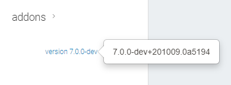

This guide details the requirements for getting help with phpVMS or vmsACARS.


## How to ask for help

:::info
Before asking for help, try to reproduce on the [demo site](https://demo.phpvms.net), and with the `default` skin
:::

Without a lot of this information, it will be difficult to provide help.

### Where to get help

#### Forums

The forums are located at [https://forum.phpvms.net](https://forum.phpvms.net). Search in the forums and on Github first for your issue before asking. For 3rd party addons, be sure to post in your own

#### Discord

There's also a Discord channel for quick questions. [Invite Code Here](https://discord.gg/wvAmMnd)

#### Github

The bug tracker is located on [Github](https://github.com/nabeelio/phpvms/issues). To post an issue, you need a Github account, and then select "New Issue". After that, select "Bug Report". There is a small template there that you can use, but try to include as much of the information below:

### Information Required

- A clear description of the issue
    - What page stuff happened on
    - Relevent data
- Versions
    - **PHP Version**
    - **Database versions** - MySQL, MariaDB or Percona, or whatever other backend your running
    - **phpVMS Version**
        - From either the admin panel (bottom left, click on the version for the full version) 
        - Running `php artisan phpvms:version`
        

- How to reproduce the error 
    - Include as much detail as possible
    - Include any relevent data - for example, an error with expenses, include how the expenses are configured. See "Exporting Data" below.
- Type of hosting - shared, VPS, dedicated, etc

#### If relevent

- Screenshots
- Logs
    - **Laravel logs**: These are located in `storage/logs`, you must include these. Look through the logs to also ensure that no sensitive information is included inadvertantly
    - **PHP logs**: These can be found wherever your PHP error logs are kept, for example, the PHP-FPM logs. Ask your host, if you don't know. They're often found in cPanel, under Error Logs.
    - **HTTP logs**: These are, for example, your Apache logs. These might be required, depending on the issue. If you're not sure how to get them, ask your host. They're often found in cPanel, under Error Logs.
- Exported data data - see below
- Any and all other relevent details

## Enable Debug and Debugging

- Look at the logs - they're located in `storage/logs`
- Enable debug logging and the Laravel Debug Toolbar:
    - Open your `config.php`, under `app`, change: 
        - `debug` to `true`
        - `debug_toolbar` to `true`

#### Exporting Data for Troubleshooting

Sometimes, additional data for troubleshooting is required. To export that data more easily, you can use the artisan YAML exporter, listing the tables to export:

```bash
cd /path/to/phpvms
php artisan phpvms:yaml-exporter table1 table2
```

---

## vmsACARS

Before asking for help, make sure to:

- Rescan your scenery
- If crashing, delete the `data` folder, and restart

When asking for help:

- Log files (these are in the `logs` folder - zipping and sending the whole folder is best)
- Other relevent files, e.g, flight plans
- System setup:
    - Sim you're using
    - Any flight sim hardware running/additional software (some of this has been seen to interfere)
