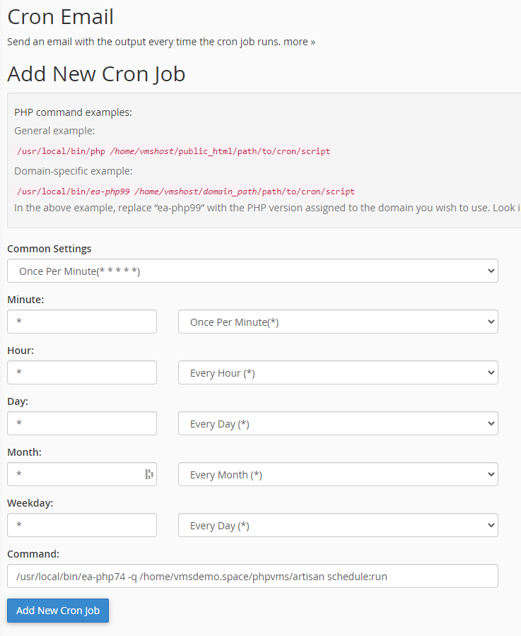

In order for some phpVMS features to work, a cronjob is required to be setup. Some of the features that rely on cronjobs include:

- Finances
- Mass Emails
- vaCentral features

:::note
If you can't run it once a minute, the lowest interval possible is fine
:::

---

## Configuration on a Server

If you have SSH and `crontab` access, this is the easiest way to configure the cron job. You need the path to the `artisan` file that's in the root of the phpVMS install. After that, add a cronjob that runs once a minute. Do not forget to include the username, for example, using `crontab -e`:

```bash
# THIS IS AN EXAMPLE 
* * * * * php /path/to/phpvms/artisan schedule:run >> /dev/null 2>&1
```

---

## cPanel Configuration

phpVMS, in the admin panel, can suggest a cron path/command for you, under `Admin -> Maintenance`. However, before trying that, try setting it up according to your host's instructions.

:::tip Note the "Domain Specific Example"
Many hosts offer multiple PHP versions, make sure to use the path to the PHP 7.x version in the cronjob. Contact your host! Point them to this page. The example below uses PHP 7.4.
:::

With cPanel, select "Once Per Minute" under "Common Settings", and you can use a similar command.

```bash
/usr/local/bin/ea-php74 -q /your/path/to/phpvms/artisan schedule:run
```



---

## Guides on setting up a cron job

- [Adding a cronjob in cPanel](https://help.fasthosts.co.uk/app/answers/detail/a_id/2198/~/setting-up-cron-jobs-in-cpanel)
- [Adding a cronjob on Linux](https://www.cyberciti.biz/faq/how-do-i-add-jobs-to-cron-under-linux-or-unix-oses/)
