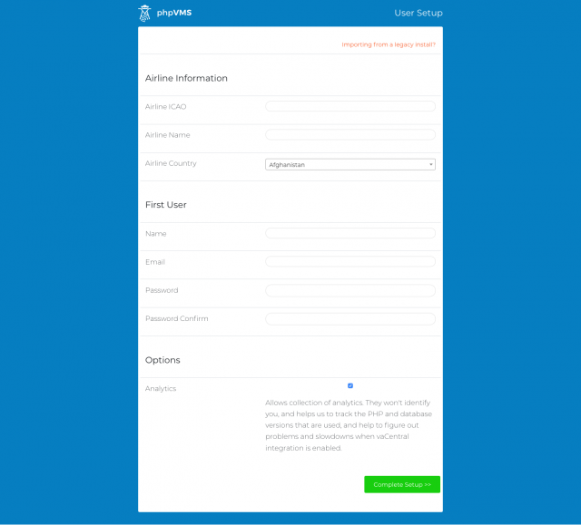

You can import through either the installer or the command line after install.

## Installer

After completing the database configuration step, you'll be given the option to import



---

## Command Line

The importer tool can also be run on the command line, via a PHP artisan command. Before running the importer, you should install phpVMS using the installer. Both the `config.php` and `env.php` files will need to exist.

:::caution
This will erase all of your current data
:::

```bash
php artisan phpvms:importer  {db_host} {db_name} {db_user} {db_pass?}
```

Where

* `db_host` - The database host where your legacy phpVMS install is
* `db_name` - The database username for your legacy phpVMS install
* `db_pass` - Database password for your legacy phpVMS install.

Example:

```bash
php artisan phpvms:importer "localhost" "phpvms_legacy" "php_legacy_username" "phpvms_legacy_password"
```

### Notes and caveats

Due to some changes with how some of the fundamentals have changed within the system, be aware of the following:

* Users will have to reset their passwords
* Column names don't entirely match up between the databases
* IDs will differ (numeric, or PIREP IDs will be converted to the new alphanumeric format)

#### Post Import Notes

* Aircraft that are imported are all placed in a generic subfleet. You will need to go and either add additional subfleets, or just rename this subfleet to whatever you want
* All flights will be assigned to this subfleet. Unfortunately, you will need to re-assign the flights to be with the proper subfleet
* Ranks are now assigned subfleets they are allowed to fly. This is different from the old version, which operated on a linear progression for the aircraft that are allowable per-rank. You will need to edit the ranks and set the subfleets that are assigned to them.