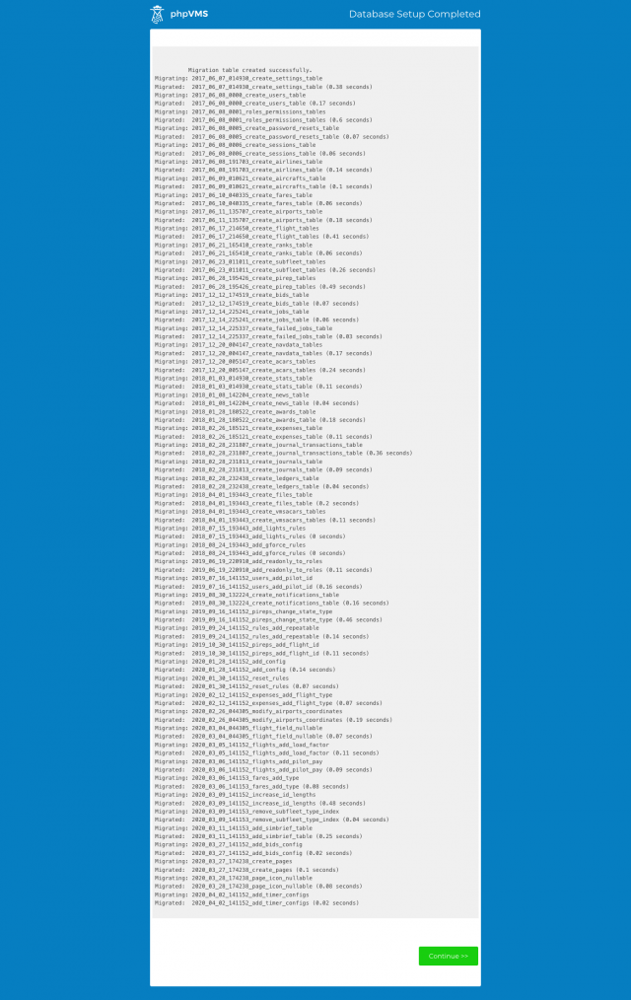
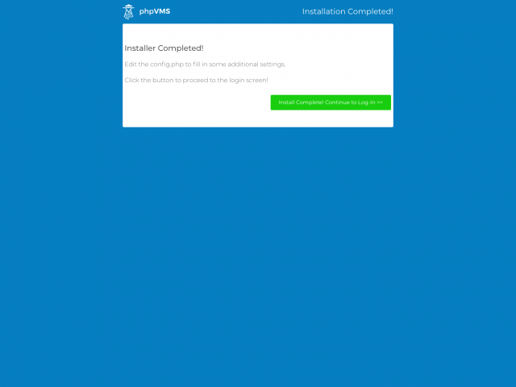
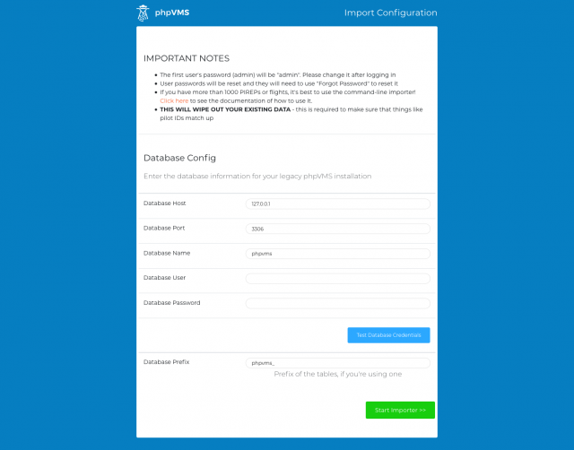

The installation requires a few steps:

1. Database Setup - right now, only MySQL (or its offshoots, like MariaDB or Percona are supported). Create the credentials for the database using either the command line or the cPanel Database Wizard.
2. Running the installer - This is a web interface, through which you can also import your older phpVMS 2.x or 5.x install

---

## Database Setup

Refer to your hosts documentation for specifics - the database name, username and password here are just examples, replace them with your own. This example is for MySQL:

```sql
CREATE DATABASE IF NOT EXISTS `phpvms` CHARACTER SET UTF8 COLLATE utf8_unicode_ci;
CREATE USER 'phpvms'@'localhost' IDENTIFIED BY 'password';
GRANT ALL PRIVILEGES ON phpvms.* TO 'phpvms'@'localhost';
FLUSH PRIVILEGES;
```

### Using the cPanel Database Wizard

You can also use the cPanel Wizard to create the credentials prior to install


---

## Running the Installer

:::info
There isn't a `setup` folder in the tar file. It's done as a Laravel route, which serves to see that your webserver/htaccess files are working correctly.
:::

Once you go to your site, you'll see a page like this, click to proceed to the installer.


After clicking next, you'll see the requirements check page. The installer will only let you proceeed if all of the requirements are met.


The next page brings you to the database setup page. 

- Enter the name of your site and the URL
- Enter your database credentials. 
  - You can test to make sure they're working by clicking the "Test Database Credentials" button.


After clicking "Setup Database", you'll see the installation screen. Hit next to proceed:




## New Install

You'll be brought to the initial setup screen. There is an option here to update yourCreate your first airline here, along with your user and password. This will be automatically made as an admin user.


After setting that up, you'll see the completion screen, where you can click next and proceed to login. You'll see your dashboard after logging in, and the installation is complete!




### Upgrading from legacy



For the database information, enter the credentials and information to your old database

---

## Next Steps

1. Read [about the configuration files](/configuration/files).
2. [Setup the cron task on your server](http://docs.phpvms.net/configuration/cron)
3. [Configure your mail server](http://docs.phpvms.net/configuration/email)
4. [Get Recaptcha working](http://docs.phpvms.net/configuration/recaptcha)
