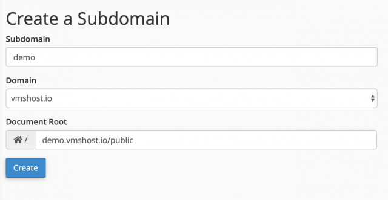
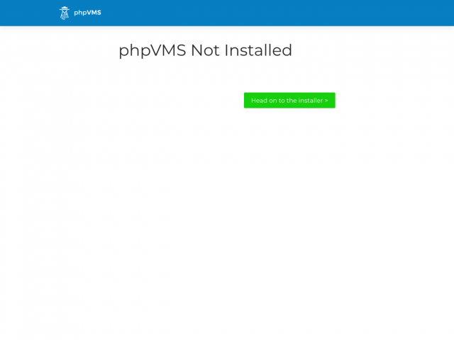
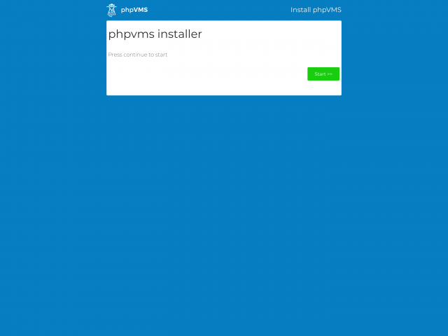
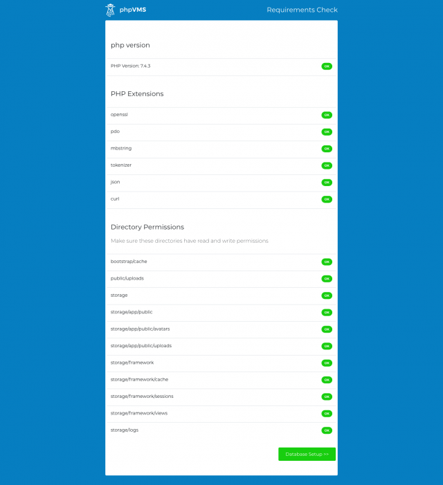
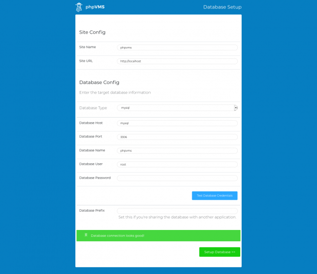

import Tabs from '@theme/Tabs';
import TabItem from '@theme/TabItem';

The first step is to upload your files, and ensure that the dependencies are loaded. If you're using a "fat" distribution, the `vendor` directory with the composer dependencies is already included.

---


# Uploading files/virtual hosts

If you are uploading to a shared host or to cPanel, chose one of the following methods when uploading your files.

:::tip
Uploading and change the path of the public directory is the recommended method
:::

<Tabs
  defaultValue="public-dir"
  values={[
    {label: 'Copy the Public Directory', value: 'public-dir'},
    {label: 'Subdomain', value: 'subdomain'},
    {label: 'Symlink', value: 'symlink'},
    {label: 'Direct Upload', value: 'direct-upload'},
  ]}>
  <TabItem value="public-dir">
  
  This method works well if your main site is going to be phpVMS, and you're not running something like Wordpress. Running phpVMS in a subdirectory isn't recommended (see method 2 instead).

  Download/upload phpVMS into a `phpvms` folder in your home folder. It should look something like:

  ```
  /home/youruser
    phpvms
    public_ftp
    public_html
  ```

  Next, copy the files from the `/public` folder into the `public_html` folder, and then open the `index.php` file, to edit this line:

  ```php
  $path_to_phpvms_folder = __DIR__.'/../';
  ```

  You'll have to change it to :

  ```php
  $path_to_phpvms_folder = __DIR__.'/../phpvms';
  ```

  That will then point to the the `/phpvms` folder, if you're following the paths above

:::note
  Updates/auto-updates won't update the files in the `/public_html` folder, you'll need to update them manually. The other method, the symlink method, is recommended if you have command-line access and are more comfortable creating those types of links.
:::
  
  </TabItem>
  <TabItem value="subdomain">
  Creating a subdomain is the next recommended method, if you're unable to change the `public_html` path (this might not always be feasiable). Upload phpVMS to a directory with the name of your subdomain, for example, `demo.vmshost.io`. It should be parallel to the `public_html` folder (as above). In this example, I want to create the subdomain `demo.vmshost.io`.

  First, create a folder to extract phpVMS into:


  ```
  /home/youruser
    demo.vmshost.io < Extract phpvms files into here
    public_ftp
    public_html
  ```

  Next, create a subdomain cPanel, go to "Subdomains", and create the subdomain. For the "Document Root", enter the path above, with the public folder - `demo.vmshost.io/public`. Usually, cPanel will autocomplete the path to be the subdomain - so just add `/public` to the end of it.

  

  It will look like this:

  

  </TabItem>
  <TabItem value="symlink">
  This method works well if your main site is going to be phpVMS, and you're not running something like Wordpress. Running phpVMS in a subdirectory isn't recommended (see method 2 instead).

  Download/upload phpVMS into a `phpvms` folder in your home folder. It should look something like:

  ```
  /home/youruser
    phpvms
    public_ftp
    public_html
  ```

  To make this work properly and be secure, we're going to change the `public_html` directory to point into the phpVMS public directory. Then you can upload files as usual, but phpVMS will be the primary entry point. When you create folder/files in the `public_html` directory, they'll actually get created into the `phpvms/public` folder.

  SSH into your server, symlink the `public_html` folder to point to `phpvms/public` instead:

  ```sh
  mv public_html public_html_backup
  ln -s phpvms/public/ public_html
  ```

  !!! Ensure that the permissions of the `phpvms` folder are correct (normally 0770), though check with your host to make sure
  </TabItem>
  <TabItem value="direct-upload">
  This method isn't recommended because it can potentially expose your install if the `.htaccess` or something isn't correctly configured. Upload the files directly into the `public_html` folder, and make sure the `.htaccess` file is active (check with your webhost). This uses the `public` folder directly
  </TabItem>
</Tabs>

---

# Database Setup

### Creating your database and credentials manually

Refer to your hosts documentation for specifics - the database name, username and password here are just examples, replace them with your own. This example is for MySQL:

```sql
CREATE DATABASE IF NOT EXISTS `phpvms` CHARACTER SET UTF8 COLLATE utf8_unicode_ci;
CREATE USER 'phpvms'@'localhost' IDENTIFIED BY 'password';
GRANT ALL PRIVILEGES ON phpvms.* TO 'phpvms'@'localhost';
FLUSH PRIVILEGES;
```

### Using the cPanel Database Wizard

You can also use the cPanel Wizard to create the credentials prior to install


---

# Running the Installer

:::info
There isn't a `setup` folder in the tar file. It's done as a Laravel route, which serves to see that your webserver/htaccess files are working correctly
:::

Once you go to your site, you'll see a page like this, click to proceed to the installer.




After clicking next, you'll see the requirements check page. The installer will only let you proceeed if all of the requirements are met.



The next page brings you to the database setup page. 

- Enter the name of your site and the URL
- Enter your database credentials. 
  - You can test to make sure they're working by clicking the "Test Database Credentials" button.




After clicking "Setup Database", you'll see the installation screen. Hit next to proceed:


## New Install

You'll be brought to the initial setup screen. There is an option here to update yourCreate your first airline here, along with your user and password. This will be automatically made as an admin user.


After setting that up, you'll see the completion screen, where you can click next and proceed to login. You'll see your dashboard after logging in, and the installation is complete!


## Upgrading from legacy


For the database information, enter the credentials and information to your old database

---

## Next Steps

1. Read [about the configuration files](/configuration/files).
2. [Setup the cron task on your server](http://docs.phpvms.net/configuration/cron)
3. [Configure your mail server](http://docs.phpvms.net/configuration/email)
4. [Get Recaptcha working](http://docs.phpvms.net/configuration/recaptcha)
